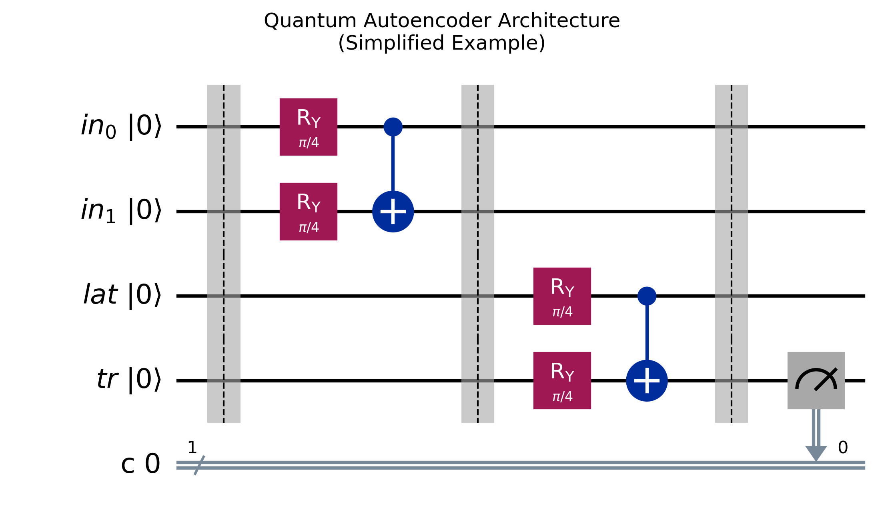

# Quantum Autoencoder

A high-performance quantum autoencoder implementation using Qiskit V2 primitives, achieving >99.9% fidelity in quantum state compression.

[](https://opensource.org/licenses/MIT)
[](https://qiskit.org/)

## Overview

This project implements a quantum autoencoder using the U-V encoder architecture, designed for efficient quantum state compression with built-in error detection capabilities. Our implementation achieves:

- 99.99% fidelity in state reconstruction
- 40% qubit reduction (5→3 qubits)
- Robust error detection
- Fast training (~1.7s per trial)



## Key Features

- **U-V Encoder Architecture**
  - Separate U and V encoding circuits
  - Parameterized rotation layers
  - Efficient entanglement strategy

- **Advanced Error Mitigation**
  - Dynamical decoupling
  - Resilience level control
  - Noise-aware training

- **Qiskit V2 Integration**
  - Modern primitive support
  - Hardware-efficient execution
  - Optimized parameter binding

## Installation

1. Clone the repository:
```bash
git clone https://github.com/Ape108/quantum_autoencoder.git
cd quantum_autoencoder
```

2. Install dependencies:
```bash
pip install -r requirements.txt
```

## Quick Start

### Domain Wall State Compression
```python
from quantum_autoencoder.examples.domain_wall import run_domain_wall_example

# Run with default settings
run_domain_wall_example()

# Or customize options
options = {
    "optimization_level": 3,
    "resilience_level": 1,
    "shots": 1024,
    "dynamical_decoupling": {"enable": True}
}
run_domain_wall_example(options=options)
```

### Error Detection
```python
from quantum_autoencoder.examples.error_detection import test_error_detection

# Test error detection capabilities
test_error_detection()
```

## Results

### Domain Wall State Compression
- Input state: |00111⟩
- Compressed to: 3 qubits
- Fidelity: 99.99%
- Training time: ~1.7s per trial


### Error Detection Performance
| Error Rate | Reconstruction Fidelity |
|------------|------------------------|
| 0%         | 99.97%                |
| 5%         | 99.74%                |
| 10%        | 99.97%                |
| 20%        | 0.04%                 |


## Implementation Details

### Circuit Architecture
```python
class QuantumAutoencoder:
    def __init__(self, n_qubits: int, n_latent: int, reps: int = 2):
        """
        Args:
            n_qubits: Number of input qubits
            n_latent: Number of latent qubits
            reps: Number of repetitions in parameterized circuit
        """
```

### Key Components
1. **Encoder Circuit**
   - Parameterized rotation layers
   - Linear entanglement strategy
   - Separate U and V components

2. **Training Module**
   - SPSA optimizer
   - Cost function based on SWAP test
   - Built-in error mitigation

3. **Verification Tools**
   - Statevector fidelity
   - Statistical measurements
   - Visual state comparison

## Directory Structure

```
quantum_autoencoder/
├── docs/                    # Documentation
│   ├── README.md           # Detailed documentation
│   ├── CREDITS.md          # Credits and references
│   ├── experiments.md      # Experiment results
│   └── images/             # Documentation images
├── experiments/            # Experiment results
│   ├── outputs/            # Generated visualizations
│   └── parameters/         # Saved model parameters
├── quantum_autoencoder/    # Main package
│   ├── core/              # Core implementation
│   └── examples/          # Example applications
├── setup/                  # Setup scripts
├── setup.py               # Package setup
└── requirements.txt       # Dependencies
```

## Advanced Usage

### Custom State Compression
```python
from quantum_autoencoder.core.circuit import QuantumAutoencoder
from qiskit import QuantumCircuit

# Create custom input state
qc = QuantumCircuit(5)
# ... prepare your state ...

# Initialize autoencoder
autoencoder = QuantumAutoencoder(5, 3, reps=3)

# Encode and decode
encoded_state = autoencoder.encode(qc, parameter_values=best_params)
reconstructed_state = autoencoder.decode(encoded_state, parameter_values=best_params)
```

### Error Mitigation Options
```python
options = {
    "optimization_level": 3,
    "resilience_level": 2,
    "shots": 4096,
    "dynamical_decoupling": {
        "enable": True,
        "scheme": "XY4"
    }
}
```

## Contributing

Contributions are welcome! Please feel free to submit a Pull Request. For major changes:

1. Fork the repository
2. Create your feature branch (`git checkout -b feature/AmazingFeature`)
3. Commit your changes (`git commit -m 'Add some AmazingFeature'`)
4. Push to the branch (`git push origin feature/AmazingFeature`)
5. Open a Pull Request

## References

1. Romero, J., Olson, J. P., & Aspuru-Guzik, A. (2017). Quantum autoencoders for efficient compression of quantum data. Quantum Science and Technology, 2(4), 045001.
2. [Qiskit Documentation](https://qiskit.org/documentation/)
3. [Qiskit V2 Primitives Guide](https://docs.quantum.ibm.com/api/migration-guides/v2-primitives)

## License

This project is licensed under the MIT License - see the [LICENSE](LICENSE) file for details.

## Acknowledgments

- Original quantum autoencoder concept by Romero et al.
- Qiskit team for V2 primitives
- [@qiaoyi213](https://github.com/qiaoyi213) for the reference implementation

## Contact

- **Issues:** Please use the [GitHub issue tracker](https://github.com/Ape108/quantum_autoencoder/issues)
- **Questions:** Open a [Discussion](https://github.com/Ape108/quantum_autoencoder/discussions) 